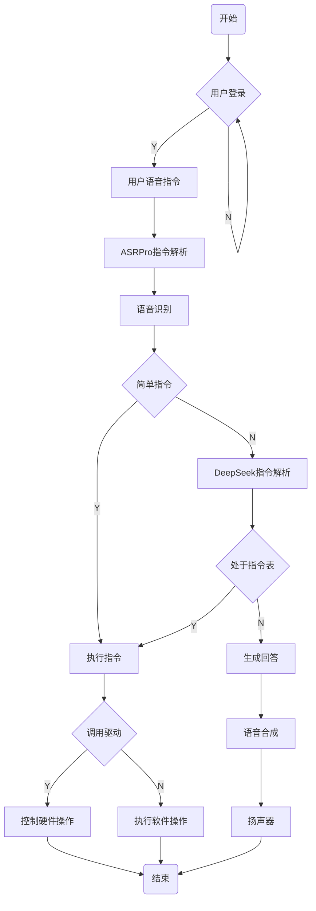

<<<<<<< HEAD
# viso_Mermaid
一个viso插件，使用Mermaid代码一键生成流程图！我再也不想画了！
=======
# Visio Mermaid 流程图生成插件

这是一个基于 **VSTO + Microsoft Visio Interop** 的 Visio 加载项项目，用来把 Mermaid 流程图代码转换成 Visio 中的流程图节点和连接线。

项目当前定位是：

- 宿主应用：`Microsoft Visio`
- 技术栈：`.NET Framework 4.7.2`、`VSTO`、`Microsoft.Office.Interop.Visio`
- 输入：Mermaid 流程图代码
- 输出：在当前 Visio 页面中自动生成流程图

## 1. 功能说明

插件当前支持一组以流程图为主的 Mermaid 子集，核心能力包括：

- 解析 Mermaid 流程图方向，如 `flowchart TD`
- 解析普通节点、判断节点、圆角节点、圆形节点、数据库节点
- 解析带标签的连接线，如 `A -->|Y| B`
- 生成 Visio 节点、连接线、箭头和基本布局
- 对判断节点、回环线、汇聚节点做特定的连线处理

当前更偏向“稳定生成常见业务流程图”，而不是完整覆盖 Mermaid 全部语法。

## 2. 环境要求

开发或运行本插件前，建议先准备好以下环境：

- Windows
- Microsoft Visio
- Visual Studio
- .NET Framework 4.7.2
- Microsoft Visual Studio Tools for Office Runtime（VSTO Runtime）

项目配置中可确认的关键信息：

- 目标框架：`v4.7.2`
- 宿主应用：`Visio`
- 加载方式：`LoadBehavior=3`

## 3. 环境搭建

### 3.1 安装基础软件

建议先安装：

- Visual Studio 2019 或 Visual Studio 2022
- Microsoft Visio
- `.NET Framework 4.7.2 Developer Pack`
- `VSTO Runtime`

如果你是做开发调试，建议在 Visual Studio 安装器里勾选与 Office 开发相关的组件。

### 3.2 打开项目

用 Visual Studio 打开解决方案文件：

- [VisioAddIn1.sln](/E:/项目/Viso流程图生成插件/VisioFlowchartExtractor/VisioAddIn1/VisioAddIn1.sln)

项目文件：

- [VisioAddIn1.csproj](/E:/项目/Viso流程图生成插件/VisioFlowchartExtractor/VisioAddIn1/VisioAddIn1.csproj)

### 3.3 调试运行

这个项目不是 `dotnet run` 类型项目，而是 Visio 加载项。  
正确的开发调试方式是：

1. 在 Visual Studio 中打开解决方案
2. 选择 `Debug | Any CPU`
3. 直接按 `F5`
4. Visual Studio 会启动 `visio.exe`
5. 插件加载后，在 Visio 顶部 Ribbon 中使用插件功能

项目调试目标已经在工程中配置为 Visio。

## 4. 插件安装方式

当前项目目录中已经包含发布产物：

- [publish/setup.exe](/E:/项目/Viso流程图生成插件/VisioFlowchartExtractor/VisioAddIn1/publish/setup.exe)
- [publish/VisioAddIn1.vsto](/E:/项目/Viso流程图生成插件/VisioFlowchartExtractor/VisioAddIn1/publish/VisioAddIn1.vsto)

推荐安装方式：

1. 关闭 Visio
2. 运行 [setup.exe](/E:/项目/Viso流程图生成插件/VisioFlowchartExtractor/VisioAddIn1/publish/setup.exe)
3. 安装完成后重新打开 Visio

不建议优先直接双击 `.vsto` 文件安装，通常 `setup.exe` 更稳。

### 4.1 如果提示“已安装另一版本”

如果安装时报类似下面的错误：

- 已经安装了另一版本的自定义项
- 不能从该位置升级

一般处理方式：

1. 打开“应用和功能”或“程序和功能”
2. 卸载旧版本 `VisioAddIn1`
3. 再重新运行 [setup.exe](/E:/项目/Viso流程图生成插件/VisioFlowchartExtractor/VisioAddIn1/publish/setup.exe)

如果系统里找不到旧项，但安装仍提示冲突，可以清理 ClickOnce/VSTO 缓存：

```powershell
rundll32 dfshim CleanOnlineAppCache
```

然后重新安装。

## 5. 如何使用插件

插件加载后，正常使用流程如下：

1. 打开 Visio
2. 在顶部 Ribbon 找到 `Mermaid流程图`
3. 点击 `从Mermaid代码生成流程图`
4. 在弹出的输入框中粘贴 Mermaid 代码
5. 点击生成

插件会在当前页面中生成流程图。

### 5.1 示例代码

可以先用下面这段测试：



## 6. 项目结构

当前项目已经做过一轮结构拆分，主干职责如下：

### 6.1 项目结构树

```text
VisioAddIn1/
├─ README.md
├─ VisioAddIn1.sln
├─ VisioAddIn1.csproj
├─ ThisAddIn.cs
├─ ThisAddIn.Designer.cs
├─ ThisAddIn.Designer.xml
├─ Ribbon.cs
├─ MermaidFlowchartService.cs
├─ MermaidForm.cs
├─ MermaidForm.Designer.cs
├─ MermaidForm.resx
├─ MermaidParser.cs
├─ VisioFlowchartGenerator.cs
├─ VisioFlowchartShapeFactory.cs
├─ VisioFlowchartLayoutEngine.cs
├─ VisioFlowchartConnectionRouter.cs
├─ UserNotificationService.cs
├─ InternalLog.cs
├─ Properties/
│  ├─ AssemblyInfo.cs
│  ├─ Resources.resx
│  ├─ Resources.Designer.cs
│  ├─ Settings.settings
│  └─ Settings.Designer.cs
├─ docs/
│  ├─ architecture-overview.md
│  └─ manual-regression-samples.md
├─ publish/
│  ├─ setup.exe
│  ├─ VisioAddIn1.vsto
│  └─ Application Files/
├─ bin/
├─ obj/
└─ VisioAddIn1_TemporaryKey.pfx
```

### 6.2 结构说明

### 入口层

- [ThisAddIn.cs](/E:/项目/Viso流程图生成插件/VisioFlowchartExtractor/VisioAddIn1/ThisAddIn.cs)
  VSTO 加载项入口，负责 Ribbon 生命周期接入

- [Ribbon.cs](/E:/项目/Viso流程图生成插件/VisioFlowchartExtractor/VisioAddIn1/Ribbon.cs)
  Ribbon UI 定义与按钮点击入口

- [MermaidFlowchartService.cs](/E:/项目/Viso流程图生成插件/VisioFlowchartExtractor/VisioAddIn1/MermaidFlowchartService.cs)
  串起“弹窗输入 -> 解析 -> 生成 -> 提示”的业务流程

### UI 层

- [MermaidForm.cs](/E:/项目/Viso流程图生成插件/VisioFlowchartExtractor/VisioAddIn1/MermaidForm.cs)
  Mermaid 输入窗口

- [UserNotificationService.cs](/E:/项目/Viso流程图生成插件/VisioFlowchartExtractor/VisioAddIn1/UserNotificationService.cs)
  统一用户提示弹窗

### 解析层

- [MermaidParser.cs](/E:/项目/Viso流程图生成插件/VisioFlowchartExtractor/VisioAddIn1/MermaidParser.cs)
  负责把 Mermaid 文本解析成内部 `FlowchartData`

### 生成层

- [VisioFlowchartGenerator.cs](/E:/项目/Viso流程图生成插件/VisioFlowchartExtractor/VisioAddIn1/VisioFlowchartGenerator.cs)
  整体编排器，负责页面准备、模具准备、节点生成、布局和连线

- [VisioFlowchartShapeFactory.cs](/E:/项目/Viso流程图生成插件/VisioFlowchartExtractor/VisioAddIn1/VisioFlowchartShapeFactory.cs)
  节点图形创建、样式设置、尺寸计算

- [VisioFlowchartLayoutEngine.cs](/E:/项目/Viso流程图生成插件/VisioFlowchartExtractor/VisioAddIn1/VisioFlowchartLayoutEngine.cs)
  页面配置和手工分层布局

- [VisioFlowchartConnectionRouter.cs](/E:/项目/Viso流程图生成插件/VisioFlowchartExtractor/VisioAddIn1/VisioFlowchartConnectionRouter.cs)
  连线创建、边分配、回环线绘制、连线样式设置

### 辅助层

- [InternalLog.cs](/E:/项目/Viso流程图生成插件/VisioFlowchartExtractor/VisioAddIn1/InternalLog.cs)
  内部调试日志输出

### 文档

- [docs/architecture-overview.md](/E:/项目/Viso流程图生成插件/VisioFlowchartExtractor/VisioAddIn1/docs/architecture-overview.md)
  架构概览

- [docs/manual-regression-samples.md](/E:/项目/Viso流程图生成插件/VisioFlowchartExtractor/VisioAddIn1/docs/manual-regression-samples.md)
  手工回归样例

## 7. 当前连线规则

当前项目中的连线规则大致如下：

- 普通节点的出边优先从下边出去
- 节点入边优先从上边进入
- 判断节点如果只有一条出边，优先从下边出去
- 判断节点如果有多条出边，优先从左右两边出去
- 回环线单独绘制，不参与普通边分配规则
- 当主优先边已被占用时，会退到距离更近的可用边

## 8. 支持的 Mermaid 范围

当前支持的是 Mermaid 流程图的一部分常见写法，包括：

- `flowchart TD`
- `graph TD`
- 普通节点：`A[文本]`
- 判断节点：`A{文本}`
- 圆角节点：`A(文本)`
- 数据库节点：`A[[文本]]`
- 带标签连接：`A -->|Y| B`
- 自循环：`A -->|N| A`

当前不建议把它当作完整 Mermaid 解释器使用，复杂子图、样式、class、子图嵌套等高级语法未必完全支持。

## 9. 开发建议

如果你要继续改这个项目，建议按下面的分层去改：

- 改 Mermaid 语法支持：优先看 [MermaidParser.cs](/E:/项目/Viso流程图生成插件/VisioFlowchartExtractor/VisioAddIn1/MermaidParser.cs)
- 改节点外观、大小：优先看 [VisioFlowchartShapeFactory.cs](/E:/项目/Viso流程图生成插件/VisioFlowchartExtractor/VisioAddIn1/VisioFlowchartShapeFactory.cs)
- 改整体间距和布局：优先看 [VisioFlowchartLayoutEngine.cs](/E:/项目/Viso流程图生成插件/VisioFlowchartExtractor/VisioAddIn1/VisioFlowchartLayoutEngine.cs)
- 改连线方向、回环、锚点规则：优先看 [VisioFlowchartConnectionRouter.cs](/E:/项目/Viso流程图生成插件/VisioFlowchartExtractor/VisioAddIn1/VisioFlowchartConnectionRouter.cs)
- 改使用流程或提示：优先看 [MermaidFlowchartService.cs](/E:/项目/Viso流程图生成插件/VisioFlowchartExtractor/VisioAddIn1/MermaidFlowchartService.cs) 和 [UserNotificationService.cs](/E:/项目/Viso流程图生成插件/VisioFlowchartExtractor/VisioAddIn1/UserNotificationService.cs)

## 10. 调试与排查

### 10.1 插件不显示

先检查：

1. Visio 是否已安装
2. VSTO Runtime 是否已安装
3. 是否在 Visio 的 `文件 -> 选项 -> 加载项 -> COM 加载项` 中被禁用
4. 是否存在旧版本冲突

### 10.2 安装失败

优先检查：

- 是否安装了旧版本
- 是否从不同目录安装过相同插件
- 是否需要清理 ClickOnce 缓存

### 10.3 生成结果不对

建议先从这几层排查：

- 输入的 Mermaid 是否属于当前支持的语法范围
- `MermaidParser` 是否正确解析
- 布局是否由 `VisioFlowchartLayoutEngine` 引起
- 连线是否由 `VisioFlowchartConnectionRouter` 引起

如果你在 Visual Studio 调试，可以关注输出窗口中的内部日志信息。

## 11. 回归测试建议

建议每次改完布局或连线规则后，至少跑一次：

- [docs/manual-regression-samples.md](/E:/项目/Viso流程图生成插件/VisioFlowchartExtractor/VisioAddIn1/docs/manual-regression-samples.md)

建议重点检查：

- 主流程是否仍然“下出上进”
- 判断节点多分支是否仍然从左右引出
- 单出边判断节点是否仍然优先走下边
- 回环线是否仍然为黑色且不影响主流程分配
- 多条线汇入同一节点时，是否仍优先上边再退最近空边

## 12. 已知说明

- 当前环境中无法直接通过本 README 验证完整编译，因为实际编译通常需要 Visual Studio / Office / Visio / VSTO Runtime 环境。
- 本项目更适合在安装了 Visio 的 Windows 环境中调试。
- 如果你是第一次接手这个项目，建议先阅读：
  - [docs/architecture-overview.md](/E:/项目/Viso流程图生成插件/VisioFlowchartExtractor/VisioAddIn1/docs/architecture-overview.md)
  - [docs/manual-regression-samples.md](/E:/项目/Viso流程图生成插件/VisioFlowchartExtractor/VisioAddIn1/docs/manual-regression-samples.md)
>>>>>>> d4ef9da (version 1.0.0)
