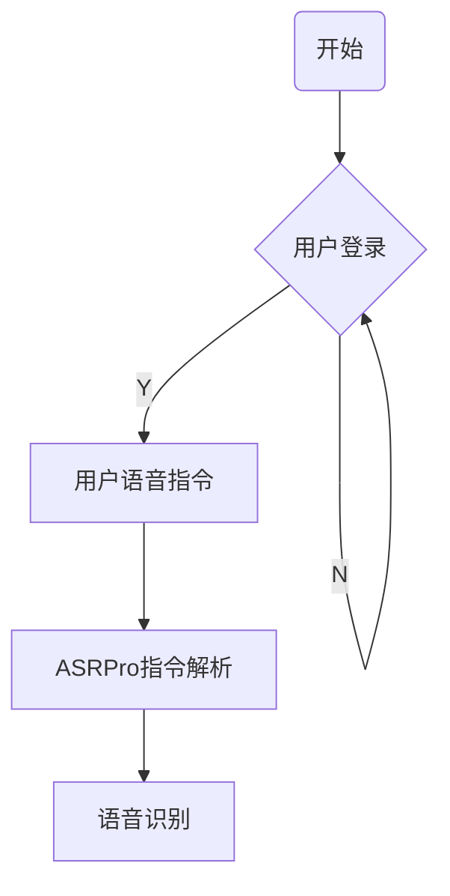
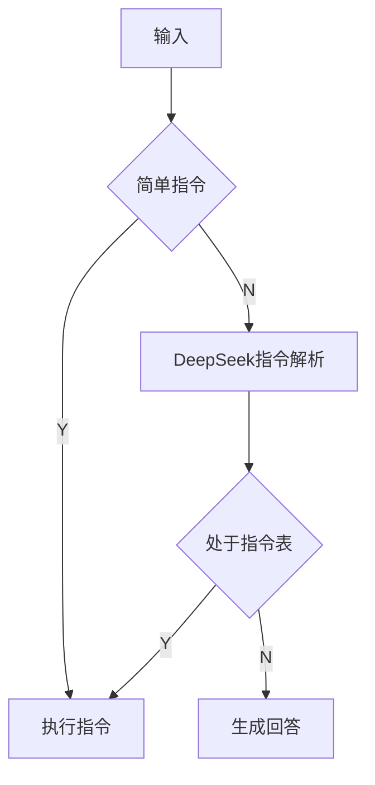
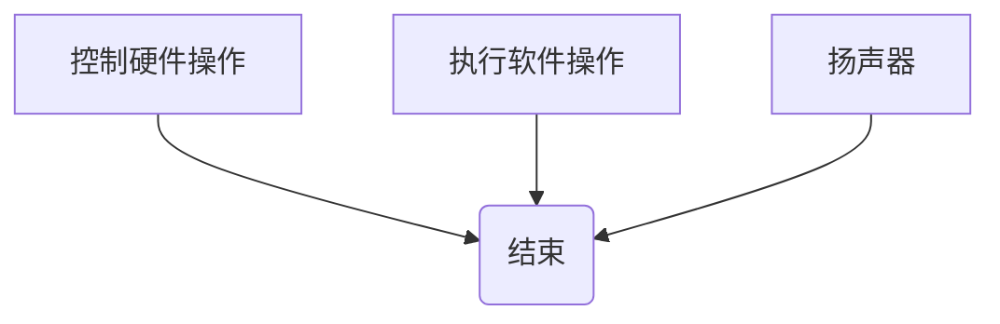
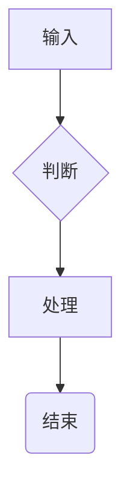
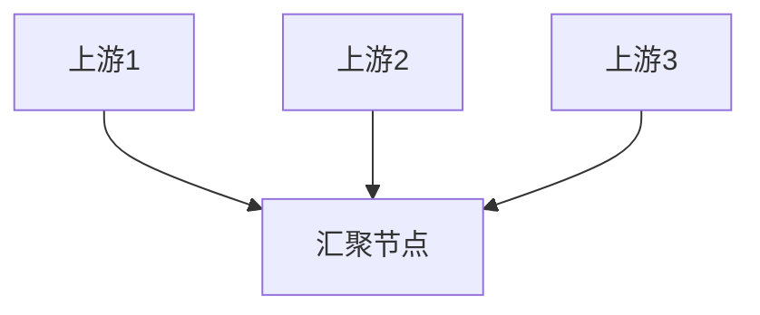

# Manual Regression Samples

Use these Mermaid snippets after routing/layout changes to catch regressions quickly.

## Main Flow + Loop

Check:
- Main flow exits from bottom and enters from top.
- Self-loop stays black and does not affect branch counting.
- `N` sits above the loop line.

## Decision Branching

Check:
- Decision nodes prefer left/right exits when branching.
- Incoming edges still prefer the top side when available.
- No node side is reused while another side is free.

## Merge Into End Node

Check:
- Incoming edges pick the top side first, then nearest free side.
- Paths remain visually short after layout changes.

## Single-Exit Decision

Check:
- The decision node uses the bottom side when it has only one outgoing edge.
- The target node still prefers the top side for incoming flow.

## Mixed Incoming Sides

Check:
- One incoming edge should claim the top side first.
- Remaining incoming edges should fall back to the nearest free side without reusing a free side late.
